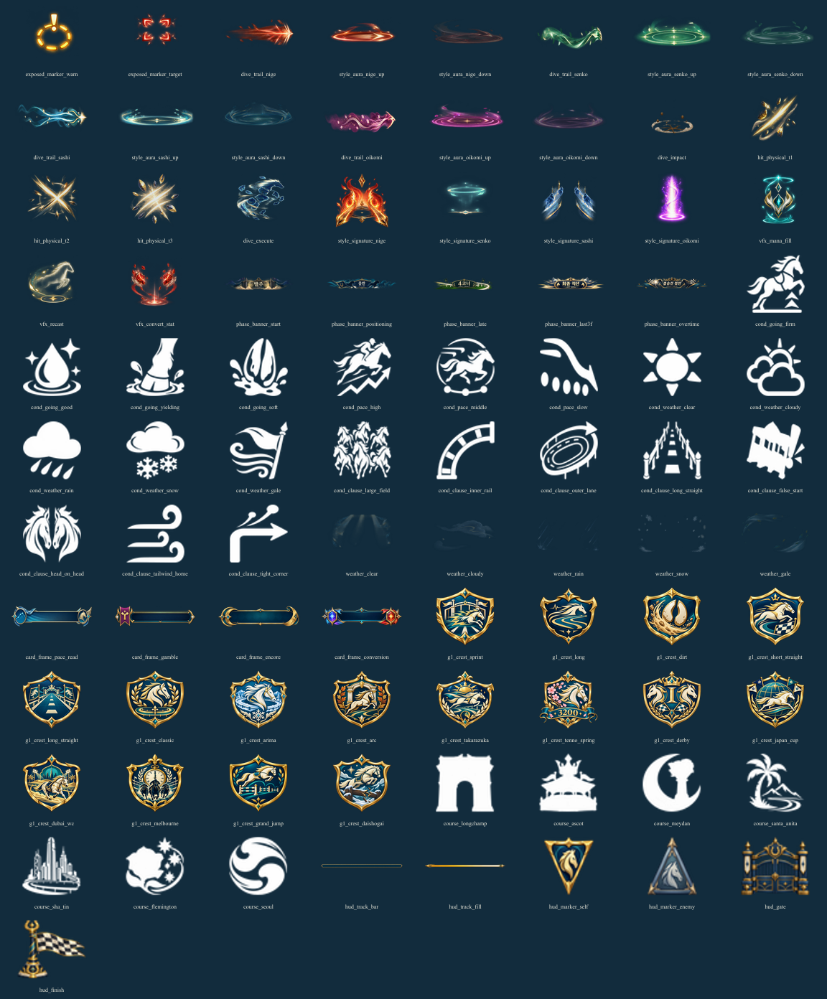

# PR25 레이스 아트 납품·검증 보고서

최신 이미지 발주서 v2의 본문 78장과 전투 연출 추가 발주 11장을 합쳐 **89장·447프레임 전부 IMAGEGEN으로 생성**했습니다. 실제 게임 렌더러, 준비 화면, 레이스 선택 UI에 연결했습니다. 날씨 경량본 5장은 별도 파생 파일로 포함합니다.

## 반영 내용

- 각질 강화/약화 오라 8장, 시그니처 4장, 페이즈 배너 5장. 전투의 실제 각질·페이스·페이즈와 연동합니다.
- 마나 충전·재시전·스탯 전환 3장. 실제 효과 대상에게 재생합니다.
- 무방비 캐리 표시·돌입 궤적·착지·처형·물리 타격 11장. 준비 표시와 엔진이 같은 보호 판정을 사용하며 이미지가 드래그 입력을 가로채지 않습니다.
- 컨디션 아이콘 20장, 날씨 5장, 카드 프레임 4장, GⅠ 문장 16장, 경마장 마크 7장, 진행 HUD 6장.
- 애니메이션은 전투 재생 시간에 맞춰 일시정지·배속·관전에 대응합니다. 모션 줄이기 설정은 정지 프레임으로 처리합니다.
- 날씨는 현재 경기에 필요한 절반 해상도 아틀라스만 로드합니다. 모든 날씨 파일은 2 MiB 이하이며, 최대 불투명도를 23%로 제한했습니다.
- 이미지 다운로드 실패에도 기존 설명과 선택·전투 컨트롤은 사용할 수 있습니다.

## 검증 결과

| 검증 | 결과 |
|---|---|
| 전체 단위·통합 테스트 | 50개 파일 / **662개 통과** |
| 관련 브라우저 테스트 | 데스크톱·노트북 **28개 통과**, 최종 경고 표시 fixture 보강 후 신규 6개 재통과 |
| 엄격 아트 검사 | **610/610**, 누락·규격 불일치 0 |
| 신규 프레임 검사 | **89장·447프레임**, SHA·크기·알파·셀 경계·프레임 중복 검사 통과 |
| 타입 검사 / 린트 / 배포 빌드 | 통과 |
| 육안 검수 | 전체 아틀라스 컨택트 시트 및 실제 브라우저 화면 확인 |

타격 착지의 인접 셀 침범, 추입 시그니처의 옆으로 퍼지는 궤적, HUD에 잘못 새겨진 페이즈 분할은 각각 IMAGEGEN 재생성으로 교정했습니다. HUD 페이즈 구분선은 이미지에 고정하지 않고 실제 엔진 임계값 위치에 그립니다.

이번 변경은 그림과 표시용 전투 이벤트를 연결합니다. 기물 능력치·상점 확률·AI 전투 보정·전투 판정은 변경하지 않았습니다. 기존 대칭 전투, 인간/AI 회귀 검사, 온라인 권위·재접속 검사도 전체 테스트에 포함됩니다. 최신 브랜치의 사용하지 않는 스크립트 import 1건은 타입 검사 통과를 위해 정리했습니다.

GitHub Actions 결과는 PR의 실시간 Checks를 확인하세요. 이 문서의 수치는 로컬 검증 결과입니다.

## 유지보수

- [프롬프트·원본/최종 SHA·재생성 사유](art-source/race-v2/jobs.json)
- [자동 이미지 검증 상세](art-source/race-v2/verification.json)
- [아틀라스 규격과 재현 방법](art-source/race-v2/README.md)

IMAGEGEN 원본은 로컬 docs/art-source/race-v2/originals/에 보존하며 PR에는 운영 PNG 94장과 검토용 미리보기, 재현 메타데이터를 포함합니다. 원본 복사본을 다시 다운로드할 필요 없이 게임은 PR 파일만으로 실행됩니다.
