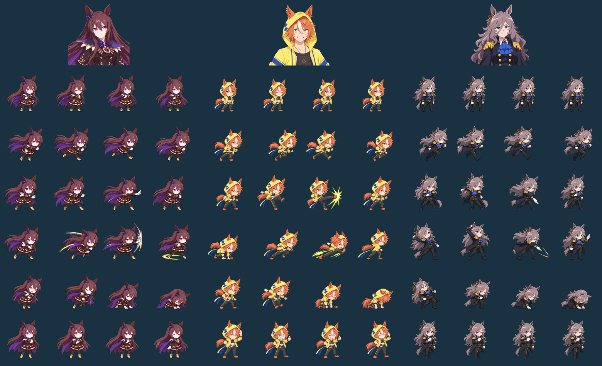

# PR27 신규 캐릭터 이미지 납품

사커 보이(2코), 쿠로후네(3코 선행), 딥 임팩트(5코)의 모션 시트3장(총72프레임), 초상화3장, 딥 임팩트 전설 컷신1장을 **내장 IMAGEGEN**으로 제작했습니다. 게임 로직이나 밸런스 수치는 변경하지 않습니다.

## 납품 파일

- public/assets/motions/{soccer_boy,kurofune,deep_impact}.png: 각512×768,4열6행,128×128RGBA,24프레임. 대기·달리기·공격·스킬·쓰러짐·승리 순서이며 스킬3번째 프레임(index14)이 발동입니다.
- public/assets/portraits/{soccer_boy,kurofune,deep_impact}.png: 각256×256RGBA.
- public/assets/characters/cutin/deep_impact.png:960×540RGBA. 그림 배경은 불투명이고 왼쪽75px는 기존 컷신 규약대로 투명 UI 여백입니다.

모션은 캐릭터당24포즈에 동일 배율을 적용하고 발 기준을(64,110)에 배치합니다. 체공 포즈는 기준보다3px위에 놓습니다. 웅크리거나 쓰러지는 포즈를 키워 머리가 커지는 정규화는 하지 않습니다. 스킬 모션에 존재하지 않는 무기·방어막·회복을 추가하지 않았습니다.

## 외형·스킬 검토

- 딥 임팩트: 흑갈색 긴 머리, 보라색 눈·케이프, 금색 삼각 치마 장식. 최신 사용자 참고에 맞춰 흰 장갑을 사용했습니다(발주서의 짙은 장갑 표기보다 사용자 원본을 우선). 손날로 지나가며 다음 대상을 돌아보는 마무리 순환.
- 사커 보이: 남성형 얼굴, 주황 머리와 흰 앞머리, 노란 후드·파란 체크·검은 바지·두 가닥 리본. 발등 슛 평타와 낮은 잔상 돌입.
- 쿠로후네: 은회색 웨이브·파란 눈, 검은 제복·금 견장·파란 프릴·흰 장갑. 길게 힘을 모은 뒤 내려치는 거인 절단. 초상화의 잘린 귀는 IMAGEGEN 재생성으로 복원했습니다.
- 딥 임팩트 컷신도 귀 끝이 잘리지 않도록 IMAGEGEN으로 구도를 다시 조정했습니다.

기존145명은 PR27 기준 비교 스크립트를 다시 실행했습니다: 신규3명, 코스트변경12명, 각질변경3명, 수치만 변경66명, **동작 계약 변경0명**. 어드마이어 베가·두라멘테·오르페브르의 실제 스킬 이미지도 확인했고, 옛 각질을 표기하는 순위 마크가 없었습니다. 기존145명의 PNG는 바꾸지 않았습니다.

## 생성·가공 출처

- prompts.json: 모든 생성 및 보정 프롬프트. API/CLI fallback은 사용하지 않았습니다.
- references/: 사용자가 제공한6개 참고 원본. 쿠로후네 단체 그림은 회색 머리의 왼쪽 인물만 참조합니다.
- originals/: 최종 IMAGEGEN 원본. 첫 출력의 배경이 RGBA가 아니어서 IMAGEGEN으로 단색 녹색 매트를 생성한 뒤 pack.mjs에서 기술적 알파 추출·색 번짐 제거·셀 분리·크기 조정만 수행했습니다.
- packing.json 및 캐릭터별 packing.json: 원본/런타임SHA-256,24프레임 좌표·배율·발 기준.
- skill-review.json: 실제 스킬JSON 및 검수 서명.
- verification.json:72프레임의 개별 해시와 알파 경계 검사.

재현: 프로젝트 루트에서 node docs/art-source/roster-2026-09-15/pack.mjs. 새로운 원본을 넣어 다시 패킹한다면 검수 메타데이터의 런타임 해시도 다시 확인해야 합니다.

납품대기7건을 모두 해제하고148명 전체를 다루는 기존 스킬/초상화/크기 검수 장부에 신규3명의 최초 기준본을 추가했습니다. 대기 목록이 빈 배열이 되었을 때 타입 추론이 never가 되던5개 아트 테스트는 목록 타입만 명시했습니다. 검사 조건은 삭제하거나 완화하지 않았습니다.

## 검증 결과

- 아트 관련5개 테스트 파일,32개 테스트 통과.
- 신규3명과 기존 전설 컷신 브라우저 검사: 데스크톱·노트북4개 통과.
- 엄격 아트 검사617/617, 납품대기0건, 규격 불일치0건.
- 신규72프레임 모두 개별 그림·RGBA·4px 투명 경계·초록색 매트 잔여 없음 확인.
- 타입 검사, 린트, 프로덕션 빌드 통과.
