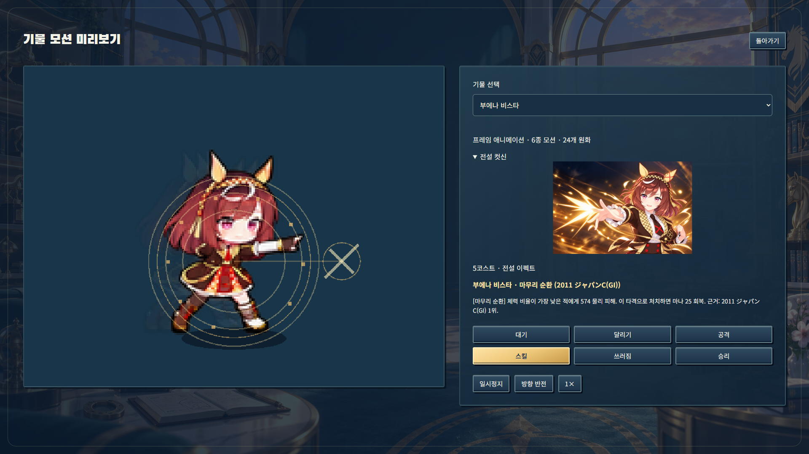
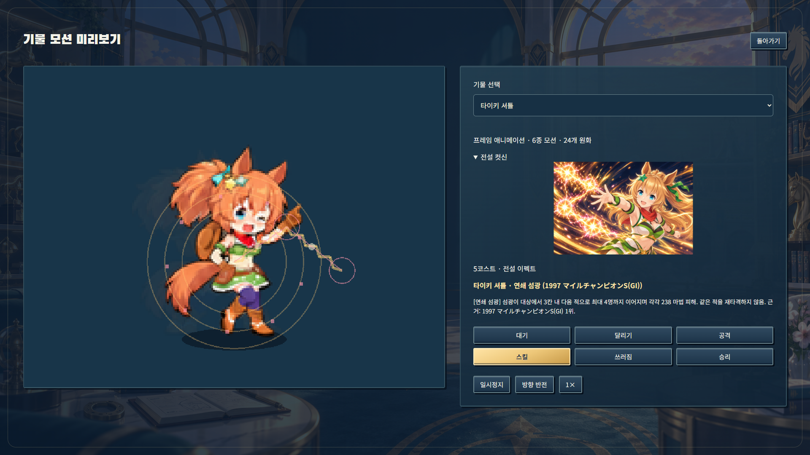

# 전설 컷신 및 발동 연출 개편

## 컷신

현재 5코스트 8명 전원에 전용 컷신을 적용했습니다. 심볼리 크리스 에스, 심볼리 루돌프, 부에나 비스타는 새로 제작했고 스페셜 위크, 다이와 스칼렛, 타이키 셔틀, 티엠 오페라 오, 미호노 부르봉은 교체했습니다.

모든 얼굴/머리/의상은 게임의 기존 초상화를 기준으로 생성하고 검토했습니다. 기본 초상화와 인게임 24프레임 시트는 변경하지 않았습니다.

마루젠스키, 키타산 블랙, 아몬드 아이의 배포용 컷신과 등록 정보는 삭제했습니다. 과거 컷신 원본은 기존 초상화 제작 근거로 참조되어 아트 기록에 보존합니다. 런타임은 현재 5코스트만 컷신을 로드하며, 승격 3명의 초상화 대체 경로도 제거했습니다.

원본은 내장 image_gen으로 생성했습니다. 첫 3명의 투명 배경 요청은 RGB 체크무늬로 반환되어 채택하지 않고 배경만 다시 생성했습니다. 최종본은 배경이 있는 시네마틱 패널이며, 1536×1024 전체 원본을 비율 유지하여 960×540에 배치했습니다. 양옆 75px은 투명 여백입니다. 얼굴을 늘리거나 추가 크롭하지 않습니다.

[전체 프롬프트](../../art-source/cutins/legendary-2026-09-12/prompts.json)
[원본 8개](../../art-source/cutins/legendary-2026-09-12)

## 스킬 모션 검토

| 캐릭터 | 검토 및 반영 |
| --- | --- |
| 크리스 에스 | 웅크림→낮은 직선 돌진이 명확하여 기존 프레임 유지 |
| 루돌프 | 조준→구속 명령이 명확하여 유지 |
| 부에나 비스타 | 준비·발동에서 같은 손짓이 길게 보여 발동 뒤 0.16초부터 회수 프레임으로 전환, 발동 원화 잔상 2개와 실제 표적에 교차 결정타·수축 조준원 추가 |
| 스페셜 위크 | 돌진의 출발·낮은 몸동작·복귀가 구분되어 유지 |
| 다이와 스칼렛 | 지면 장판 생성 동작이 구분되어 유지 |
| 타이키 셔틀 | 연쇄 타격이 몸동작에 드러나지 않아 0.16초 후 회수 전환, 발동 원화 잔상 2개, 실제 적중 대상 순서의 전기선·이동 섬광 추가 |
| 티엠 오페라 오 | 망토 펼침과 방패 동작이 구분되어 유지 |
| 미호노 부르봉 | 양손 충전→광선 유지가 구분되어 유지 |

추가 수정은 프레임 재생·잔상·효과 코드입니다. 4프레임 원화는 재생성하지 않았습니다. 몸 크기·발 위치·얼굴을 변형하지 않습니다. 효과는 실제 DAMAGE 이벤트에서만 실행하고 대상을 추가하거나 판정/피해량/마나를 변경하지 않습니다. 모션 미리보기에도 같은 효과를 사용하고 전설 컷신 확인 항목을 추가했습니다.

## 검증

- 관련 단위 검사 19개 통과(컷신 명단/원본 해시/비율 유지 패킹/발동 시점, 기존 스킬·코스트 회귀).
- 엄격 자산 검사 514/514, 데이터 검증, 타입 검사, 린트, 빌드 통과.
- 신규 전설 컷신 검사와 기존 스킬 미리보기 검사: 데스크톱·노트북 총 4개 통과.
- 로스터·스킬 데이터, 초상화 및 모션 아틀라스 변경 없음.
- 재패킹: `node scripts/package-legendary-cutins.mjs`.
- 최종 높이 보정 뒤 전설 브라우저 검사를 재실행했습니다.

