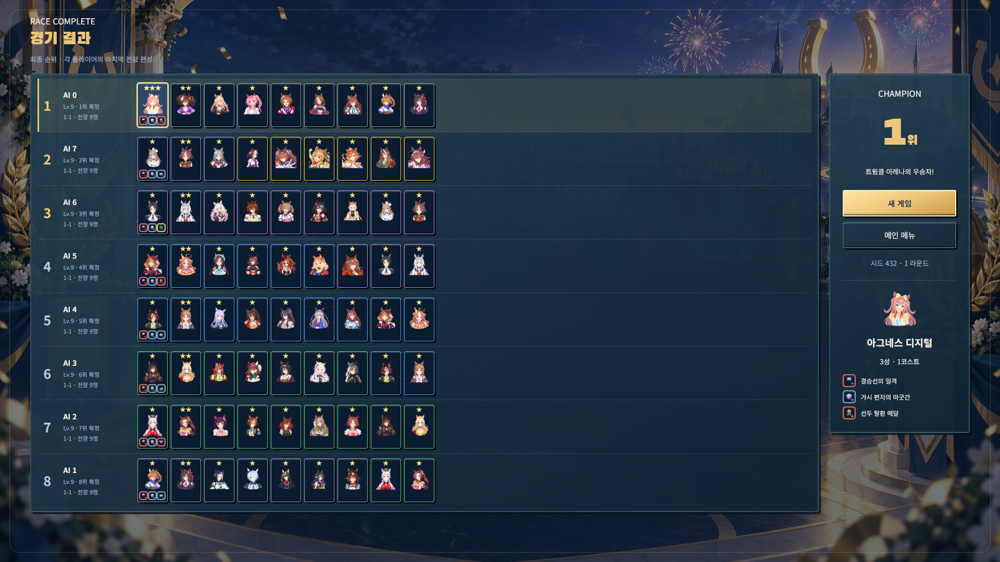
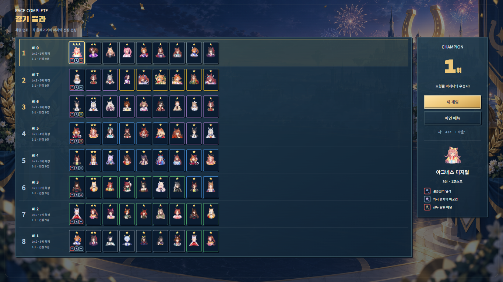
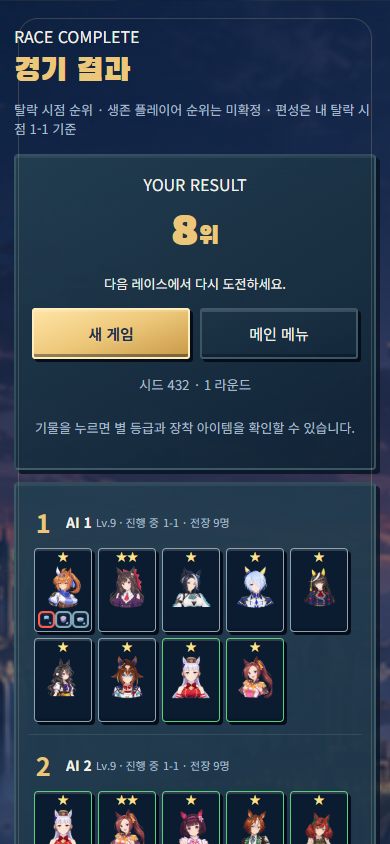

# 최종 편성 결과 화면

PR15 머지 이후의 별도 기능 패치입니다.

게임 결과에 8명의 순위, 이름, 레벨, 전장 기물 초상화, 별 등급과 장착 아이템을 표시합니다. 기물을 선택하면 이름·코스트·아이템 이름을 확인할 수 있고, 내 결과와 새 게임/메인 메뉴 버튼을 함께 제공합니다. 기물이 많으면 줄바꿈하며 숨기지 않습니다.

## 기록 기준

- 탈락 정산 시 공유 풀로 기물을 반환하기 전에 전장 편성을 복사합니다.
- 먼저 탈락한 사람은 자신의 탈락 당시 편성을 유지합니다.
- 내가 중간에 탈락하면 그 순간 살아 있던 상대의 편성을 고정하여 보여줍니다. AI의 이후 편성으로 바뀌지 않습니다.
- 오프라인 중도 탈락 후 남은 AI 경기를 자동 계산하지 않고 바로 결과를 표시합니다. 생존자의 순서는 현재 체력 기준이며 ‘진행 중’으로 명시하고 최종 순위처럼 확정하지 않습니다.
- 끝까지 살아남으면 각 참가자의 마지막 전장 편성을 표시합니다. 마지막 전투 후 경험치 증가도 편성 기록의 레벨을 바꾸지 않습니다.
- 온라인에서는 남은 사람의 경기가 계속되며 실제 확정 순위는 갱신되어도 편성은 내 탈락 시점 기록을 유지합니다.
- 대기석·상점·미장착 아이템은 상대에게 공개하지 않습니다. 기록은 공유 풀 소유량에 포함하지 않습니다.
- 신규 기록은 저장/이어하기에 보존됩니다. 패치 이전에 이미 사라진 탈락자 기물은 복원할 수 없어 기록 없음으로 표시합니다.

## 검증

- 전체 단위 검사: 30개 파일, 475개 통과.
- 마지막 보정 후 결과/전투 흐름 회귀 검사: 13개 통과.
- 타입 검사, 린트, 프로덕션 빌드 통과.
- 신규 브라우저 검사: 4개 통과. 1920×1080 / 1366×768 우승 결과, 390×844 중도 탈락 및 재접속 결과.
- 8명 × 9기물 = 72개의 초상화가 모두 렌더링되고 이미지 로딩, 3성·3아이템 상세, 모바일 가로 넘침 없음, 새 게임 이동을 확인했습니다.
- 엔진 검사로 탈락 전 복사, 아이템/위치 복사 독립성, 이후 AI 진행 후 기록 불변, 공유 풀 보존, 저장/복원, 이전 저장 파일 대응을 확인했습니다.
- 기존 전체 브라우저 모음은 이번 패치에서 재실행하지 않았으며 PR 자동 검사에서 실행합니다.

