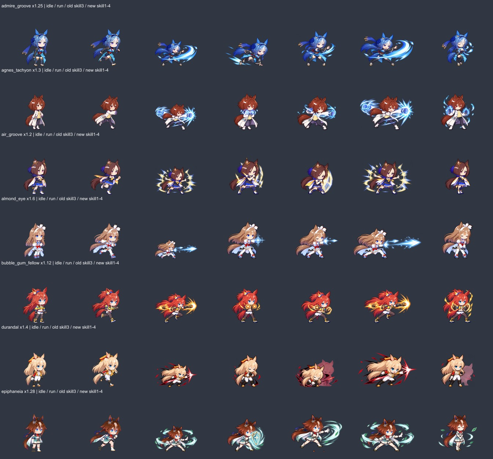
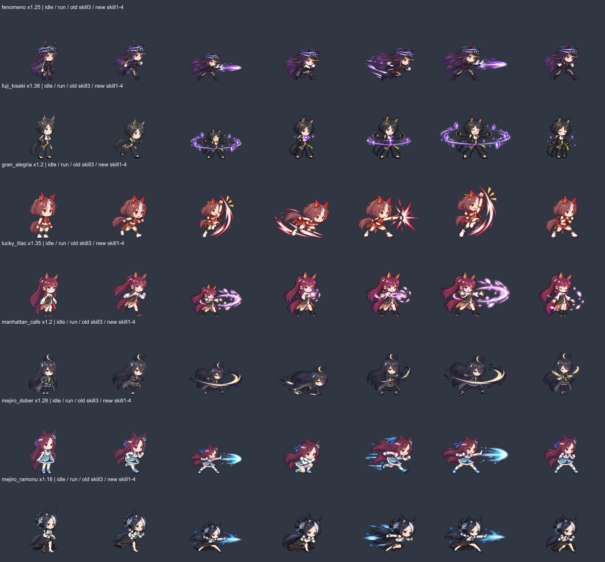
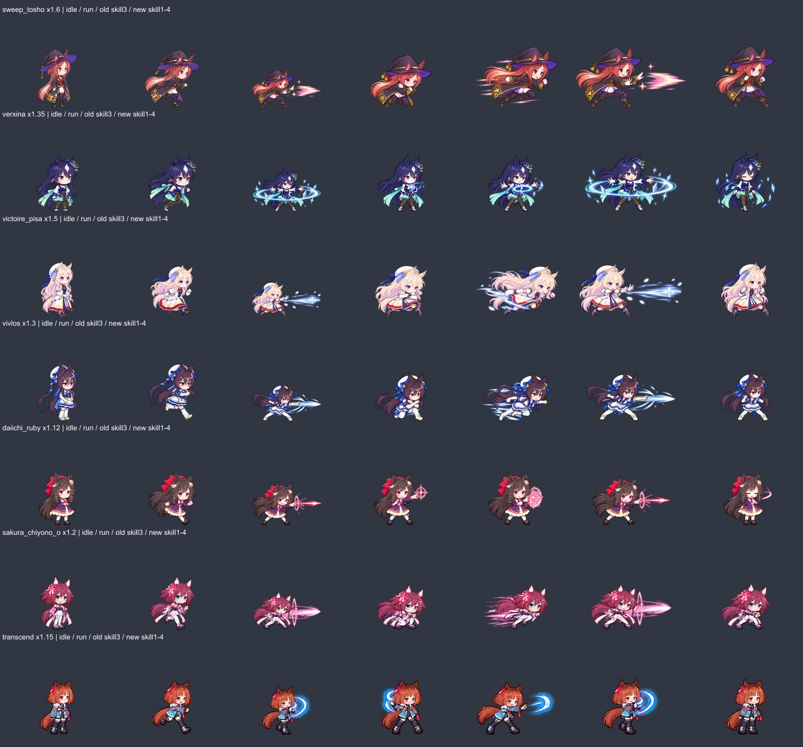

# 스킬 모션 크기 보정

기준: PR13 머지 커밋 `95f96727aeb608dd15e630ee654cdc064ef060f5`. 전체 145명을 대기·달리기·공격·스킬 4프레임으로 비교했습니다. 21명의 스킬 84프레임을 보정하고 124명의 이미지는 유지했습니다.

스킬 전용 원화의 큰 광선·궤적까지 116×104 영역 안에 맞추는 패킹이 캐릭터 몸체를 작게 만들었습니다. 기존 원본의 얼굴·몸통을 이동/공격과 비교해 클립별 배율을 정했고, 4프레임에 동일 배율을 적용했습니다. 웅크림·돌진·원근에 따른 자연스러운 높이 차이는 유지합니다. 새 그림 생성이나 얼굴 변경은 없습니다.

보정 대상의 셀은 256×256(기존 논리 크기 128, 여백 64, 발 기준점 128/174)입니다. CSS 배치·Phaser 전투·모션 미리보기가 동일한 픽셀 배율과 발 기준점을 사용합니다. 이펙트용 여백이 캐릭터를 다시 축소하지 않습니다. 스킬 외 20프레임은 원본 RGBA 픽셀을 그대로 복사했고, 선택하지 않은 캐릭터의 파일 해시도 동일합니다.

| 캐릭터 | 스킬 배율 |
|---|---:|
| 후지 키세키 | 1.38× |
| 에어 그루브 | 1.20× |
| 아그네스 타키온 | 1.30× |
| 스윕 토쇼 | 1.60× |
| 메지로 도베르 | 1.28× |
| 사쿠라 치요노 오 | 1.20× |
| 트랜센드 | 1.15× |
| 다이이치 루비 | 1.12× |
| 메지로 라모누 | 1.18× |
| 비블로스 | 1.30× |
| 어드마이어 그루브 | 1.25× |
| 뒤랑달 | 1.40× |
| 버블검 펠로 | 1.12× |
| 페노메노 | 1.25× |
| 아몬드 아이 | 1.60× |
| 럭키 라일락 | 1.35× |
| 그란 알레그리아 | 1.20× |
| 에피파네이아 | 1.28× |
| 빅투아르 피사 | 1.50× |
| 베르시나 | 1.35× |
| 맨하탄 카페 | 1.20× |

## 전후 비교

각 행: 대기 / 이동 / 보정 전 스킬 3 / 보정 후 스킬 1·2·3·4. 같은 픽셀 배율로 비교했습니다.

## 재현 및 검증

`npm ci` 후 `node scripts/normalize-skill-scale.mjs`. Git 기준 커밋이 필요합니다(얕은 복제에서는 해당 커밋을 먼저 fetch). 스크립트는 해시가 다른 미검토 원화나 스킬을 덮어쓰지 않으며, 과거 패커도 확장된 시트의 레이아웃을 덮어쓰지 않도록 중단합니다.

[145명 검토 및 배율](../../art-source/motions/skill-scale-2026-09-12/review.json)과 캐릭터별 패킹 기록에 원본 크롭·해시·배율·좌표를 남겼습니다. 회귀 검사는 보존된 420프레임의 픽셀 동일성, 유지한 124명의 파일 해시, 스킬 원본 재추출 결과, 투명 경계, 세 화면의 픽셀 배율 및 발 위치를 확인합니다.
