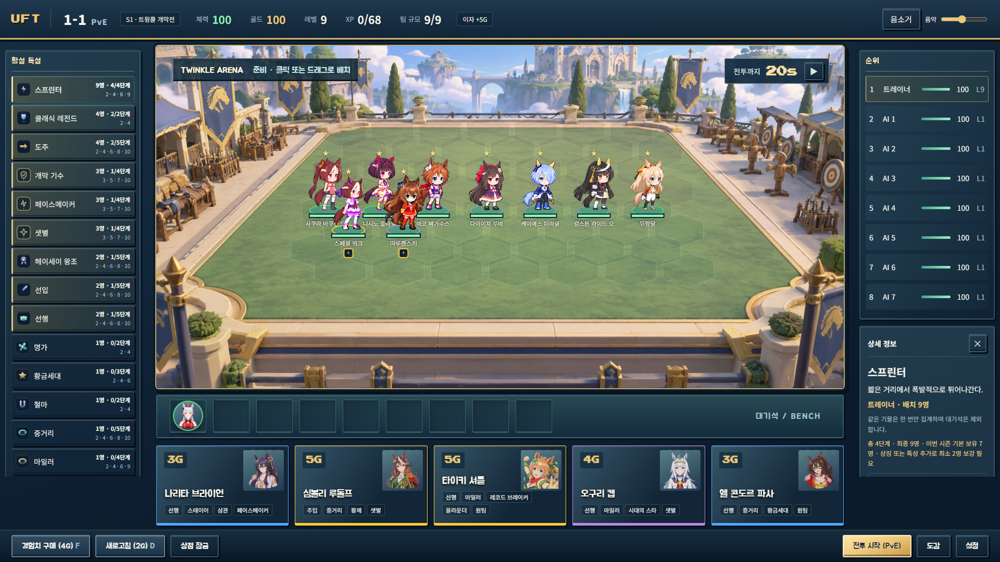
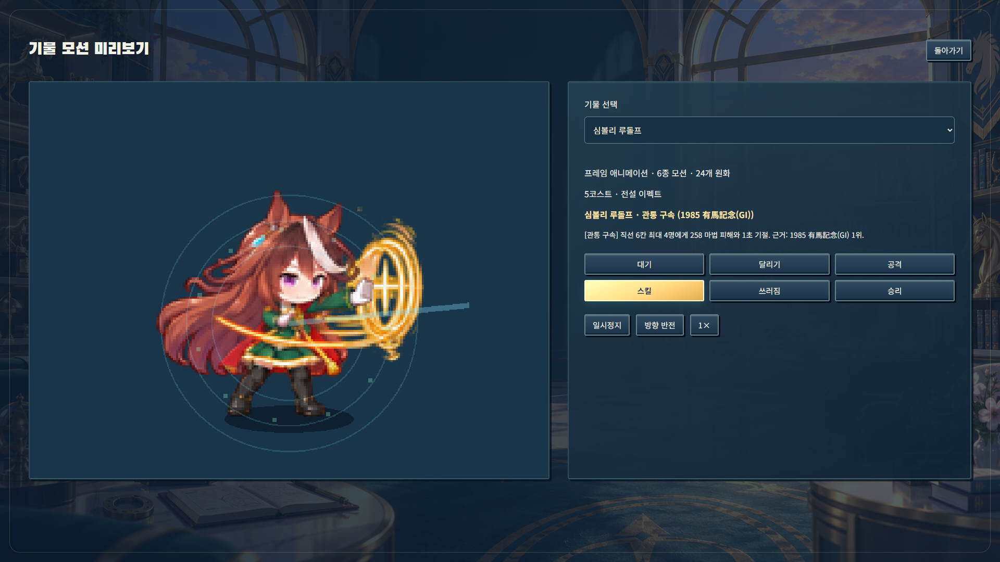

# 특성 단계·코스트·스킬 밸런스 패치

기준: PR14 머지 `9cf7bae43b1f5168e4a34353946892c21ba75c45`.

## 특성 최종 조합

기존 초반 혼합 조합의 수치는 유지하고, 넓은 기물 풀을 가진 30개 특성을 4~5단계로 확장했다. 효과는 가장 높은 단계 하나만 적용한다.

| 특성 | 단계별 필요 기물 |
|---|---|
| 도주·선행·선입·추입 | 2 / 4 / 6 / 8 / 10 |
| 중거리·헤이세이 왕조 | 2 / 4 / 6 / 8 / 10 |
| 스프린터·마일러·스테이어 | 2 / 4 / 6 / 9 |
| 더트 챔피언 | 2 / 3 / 4 / 6 |
| 시즌 전용 20개 진영 | 3 / 5 / 7 / 10 |

황제 등 고유·희소 특성은 인위적으로 10명까지 늘리지 않았다. 최종 단계의 실제 효과는 생성 데이터 `src/data/generated/traits.json`, `seasons.json`에 기록된다. 선입은 처치 관여, 추입은 적의 낮은 체력, 중거리와 스테이어는 전투 지속 시간이 여전히 필요하다. 마나·방어·공격 능력치를 모두 동시에 크게 올리는 일괄 최종 보너스는 없다.

스프린터 기본 보유자는 S1~S5에 각각 7/5/5/5/4명이다. 따라서 9스프린터는 기본 기물만 모아 달성할 수 없고, 상징 또는 기존 특성 추가 보상으로 각각 최소 2/4/4/4/5명을 보강해야 한다. 최종 조합은 희귀한 목표이며, 중간 4·6단계로도 플레이할 수 있다. 같은 기물 중복 및 기본 보유자에게 장착한 상징은 인원을 늘리지 않는다. 다른 넓은 특성의 10명 조합에는 레벨 및 편성 인원 투자가 필요하다.

특성 목록은 현재/전체 단계와 모든 중단점을 두 줄로 표시한다. 상세 창에 이번 시즌 기본 보유자 수와 부족한 추가 인원을 표시한다.

설계 참고: Riot의 [Horizonbound 소개](https://teamfighttactics.leagueoflegends.com/en-au/news/game-updates/runeterra-reforged-horizonbound-gameplay-overview/)는 9빌지워터를 레벨 9와 상징 2개가 필요한 조합으로 설명한다. 여기서는 자연 보유자보다 높은 최종 중단점이라는 원칙을 적용했다. 특정 TFT 세트와 수치를 동일하게 복제한 패치는 아니다.

## 5코스트 각질 분포와 교환

모든 시즌에서 도주/선행/선입/추입이 **4/3/1/0 → 2/2/2/2**로 바뀐다. 실제 경기 근거로 정한 각질은 그대로 유지했다.

| 기물 | 이전 → 변경 |
|---|---|
| 마루젠스키 | 5 → 4 |
| 키타산 블랙 | 5 → 4 |
| 아몬드 아이 | 5 → 4 |
| 심볼리 크리스 에스 | 4 → 5 |
| 심볼리 루돌프 | 4 → 5 |
| 부에나 비스타 | 4 → 5 |

시즌별 60명 및 코스트별 14/14/13/11/8명, 145명 전체 시즌 등장, 5코스트 단일 역할 비중 45% 이하를 유지한다. 체력·공격력·방어 능력치도 새 코스트 기준으로 생성한다. 4코스트에 지원/전열/주력 딜러 선택지가 추가된다.

## 코스트별 스킬 체감

| 코스트 | 같은 스킬의 기본 위력 배율 | 긍정적 능력치 버프 배율 | 발동 이펙트 |
|---|---:|---:|---|
| 1 | 1.00 | 1.00 | 기본 충격파 |
| 2 | 1.14 | 1.06 | 확대 충격파·입자 추가 |
| 3 | 1.32 | 1.14 | 정예 충격파·잔상 1겹 |
| 4 | 1.56 | 1.24 | 굵은 충격파·잔상 2겹 |
| 5 | 1.90 | 1.36 | 전설 충격파·잔상 3겹·추가 도트 입자 |

이전 기본 위력은 1.00/1.08/1.16/1.26/1.40배였다. 변경 배율은 동일 키트·동일 원본 능력치 백분위에서 비교한 수치이며, 서로 다른 스킬의 실제 DPS가 이 비율로 고정된다는 뜻은 아니다. 피해·회복·고정 보호막과 긍정적인 비율 능력치 버프에 반영되고, 설명도 실제 값과 일치한다. 제어 시간, 대상 수, 범위, 발동 지연은 유지해 고코스트 제어 효과가 무한 반복되는 것을 피했다. 저코스트 3성의 동일 스킬은 여전히 5코스트 1성보다 큰 위력을 낸다.

91개 키트의 수치가 변경되었다. `cost-skill-compatibility.json`에 이전 스킬 전체와 이전/이후 해시를 보존하고 숫자 외 모션 계약이 같음을 검증했다. 캐릭터 원화·얼굴·몸 크기는 그대로이며, 전투 및 모션 미리보기의 이펙트 레이어만 코스트별로 달라진다. 승격한 3명의 컷인은 승인된 초상화를 비율 유지하여 재사용하고 자산 검사에 명시했다.

## 검증과 측정 범위

- 단위 검사 471개, 자산 엄격 검사 514개, 프로덕션 시작 경로 9개 통과.
- 신규 브라우저 검사 10개 통과: 두 화면 크기에서 9스프린터 실제 활성화·상징 필요 인원 안내·모션 효과, 배경 요청 실패 복구·6칸 상점. 전체 브라우저 결과는 PR 설명에 기록한다.
- 변경 전후 동일 시드로 시즌마다 20경기씩, 총 200경기: `campaigns.json`. 모든 시즌에서 풀 보존 위반 0, 모든 경기 종료.
- 각 특성·단계별 8개 시드와 양쪽 배치 교환: `paired-traits.json`. 같은 2성 팀에 시험할 특성만 추가한 **증분 효과 측정**이며, 조합별 실제 승률이 아니다. 8~10명 단계는 팀 크기도 달라져 단순 승률 순위를 비교해서는 안 된다.
- 시뮬레이터의 주력 특성 점유율은 우승 팀을 대표 특성 하나로 분류한 값이다. 표본 수가 작고 다른 특성·아이템·AI 조합이 섞이므로 특성 자체의 승률과 구분한다. S1 개막 기수, S2 도주 및 S3 빠른 레벨업 AI의 경고는 원본 로그에 숨기지 않고 남겼다.
- S1은 다른 시드 `20270912`로 40경기를 추가 검증했다(`s1-validation.json`). AI별 평균 순위는 3.95~4.92위로 목표 범위 안이고, 개막 기수의 대표 특성 우승 점유율은 27.5%였다. 이 특성이 활성화된 최종 보드 111개 중 25개 우승/80개 4위 이내였다. 기물·아이템·경기 진행도까지 통제한 인과적 특성 승률은 아니므로, 점유율 경고 하나만으로 추가 너프하지 않았다. 변경 전후와 추가 표본을 합쳐 총 240경기를 검증했다.

